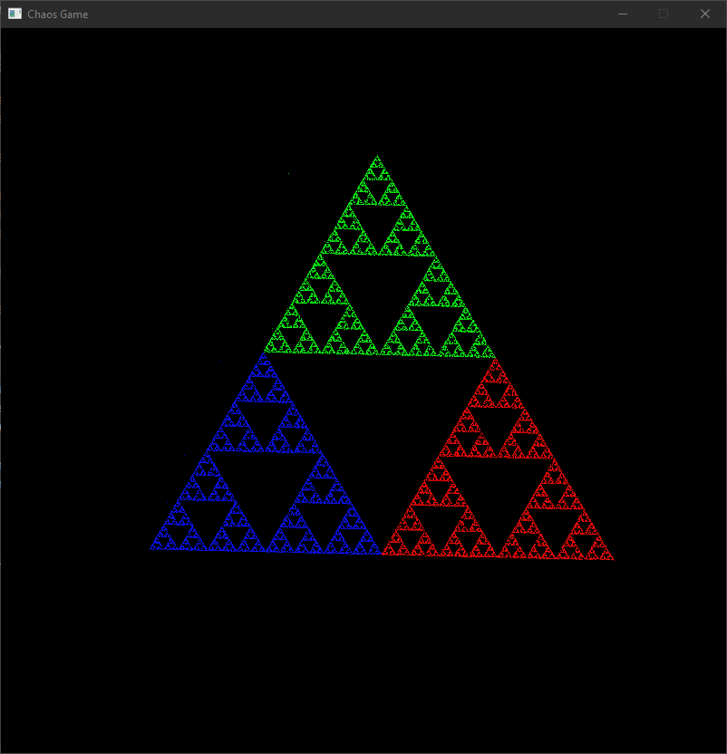
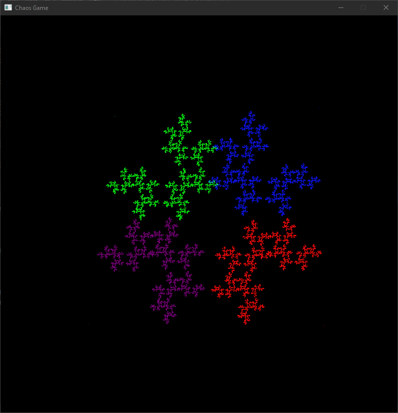
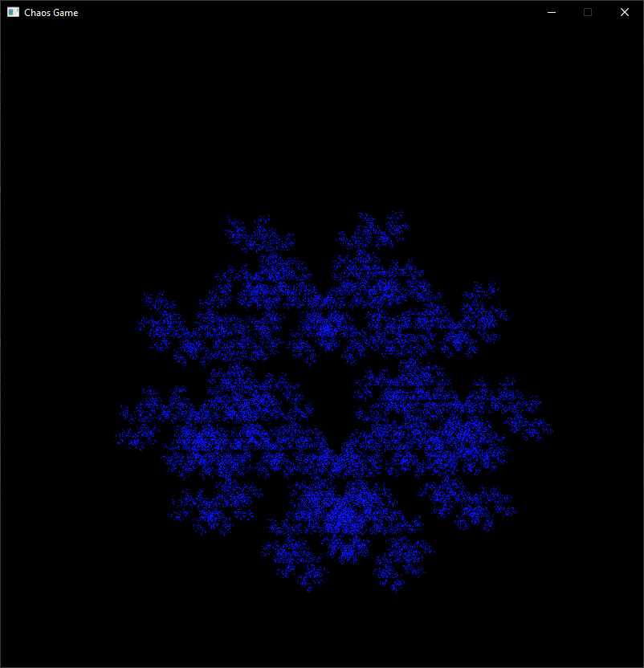

# Chaos Game
Simple [chaos game](https://en.wikipedia.org/wiki/Chaos_game) made in Rust with Piston.

## Build

```
cargo build
```

## Run
```
cargo run Chaos-Game.exe [options]
```

**[Options]**
```
-v,--vertices   Sets the number of starting vertices. Default 0. Ex -v 3
-j,--jump       Sets the jump distance. Default 0.5. Ex -j 0.33
-c,--color      Uses only one color.
-h,--help       Prints this help menu.
```

Example
```
cargo run Chaos-Game.exe -v 3 -j 0.33
```

## Controls

* ```s``` Starts the game
* ```p``` Pauses the game
* ```r``` Restarts the game
* ```LMB``` Adds vertices at the current position of the cursor

## Fractals




## License
This software is licensed under the MIT License